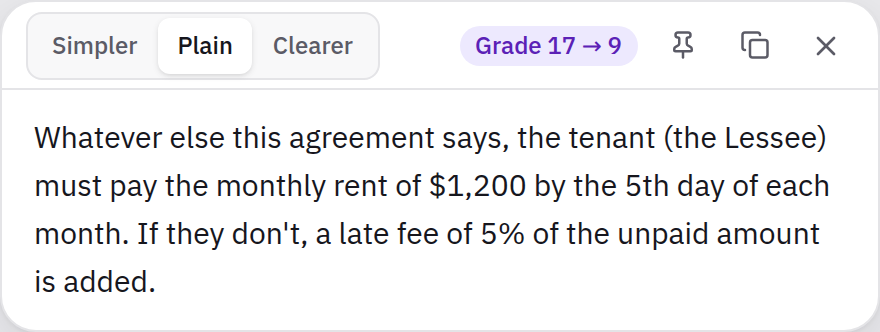
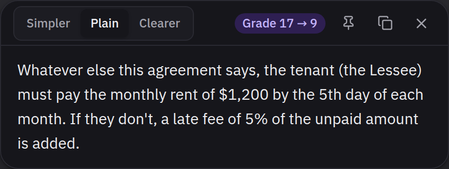
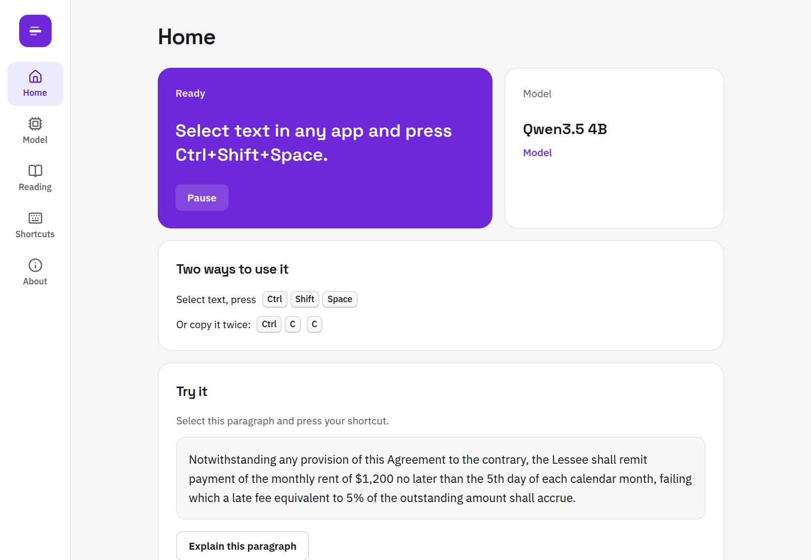

# Text Explainer

Select text you're reading anywhere, press one key, and a clearer version appears next to
it. Fully offline, on an ordinary 8 GB laptop with no graphics card.

> **Status:** in development. Windows first. Progress: [`docs/PROGRESS.md`](docs/PROGRESS.md).

<p>
  
  
</p>

- **Readable rewrites, not definitions.** Long sentences, jargon and acronyms become plain
  language at the level you choose (Simpler, Plain, Clearer), keeping every number, date
  and name. A badge shows the reading grade before and after.
- **Never in your way.** The card appears beside what you're reading without taking focus
  from the app you're in. Esc or a click elsewhere closes it.
- **Two ways in.** Select text and press the shortcut (Ctrl+Shift+Space by default), or
  press Ctrl+C twice.
- **It checks itself.** If the rewrite drops or invents a number, date or name, the card
  says so. Answers can't drift into another language: the model is constrained at the
  token level.
- **Runs on your machine.** A small open model through llama.cpp. Nothing you read leaves
  your computer.
- **Your model, your rules.** Pick a model that fits your memory, bring any GGUF file or a
  local Ollama / LM Studio server, and tune every setting, including the instructions.



## How it works

```
selection ─▶ UI Automation (or clipboard-safe copy) ─▶ repair PDF text ─▶ detect language
          ─▶ split long text ─▶ llama-server (grammar blocks other scripts) ─▶ hide chatter
          ─▶ meaning check + reading grade ─▶ the card
```

More in [`docs/marketing/architecture.md`](docs/marketing/architecture.md).

## Built with

Rust · Tauri 2 · React + TypeScript · Tailwind CSS · Radix · llama.cpp

## Development

```bash
npm ci
scripts/check.sh          # every check CI runs on Linux, including a Windows type-check
npm run tauri dev         # run the app (on Windows)
npx vite                  # the interface in a browser, against a mock (popup.html?demo=passage)
```

See [`docs/IMPLEMENTATION_PLAN.md`](docs/IMPLEMENTATION_PLAN.md) for the plan and
[`CLAUDE.md`](CLAUDE.md) for conventions.

## License

MIT. Models have their own licenses, shown in the app before download.
