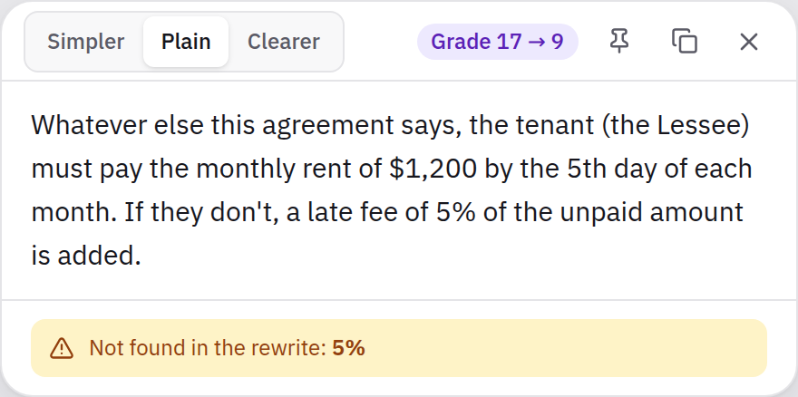
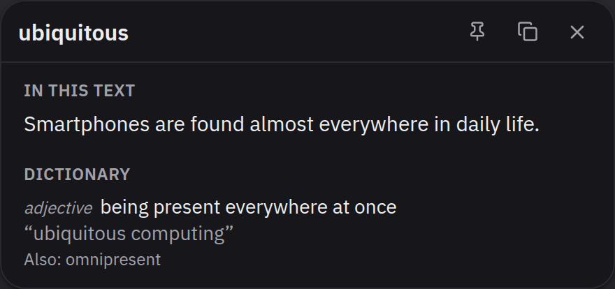
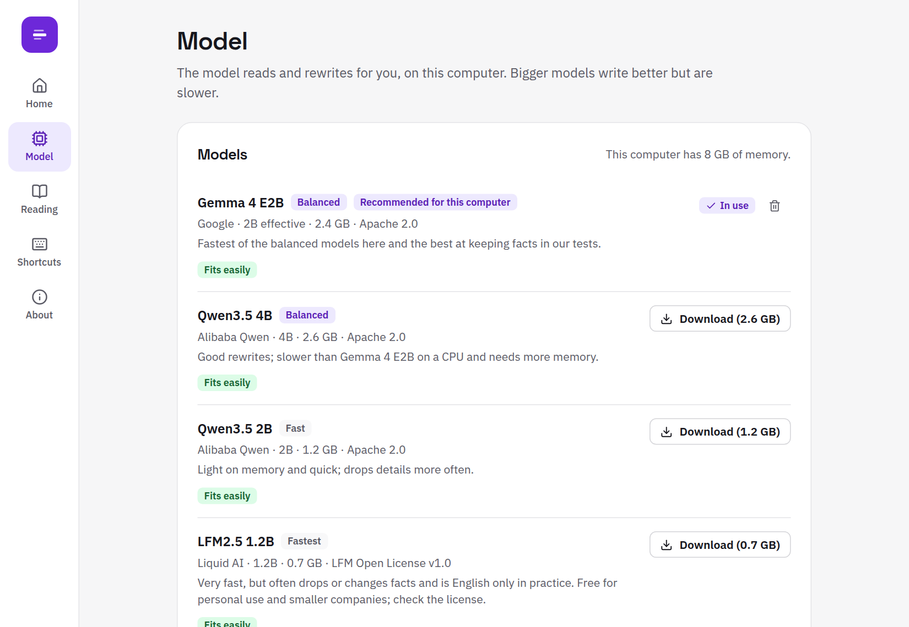
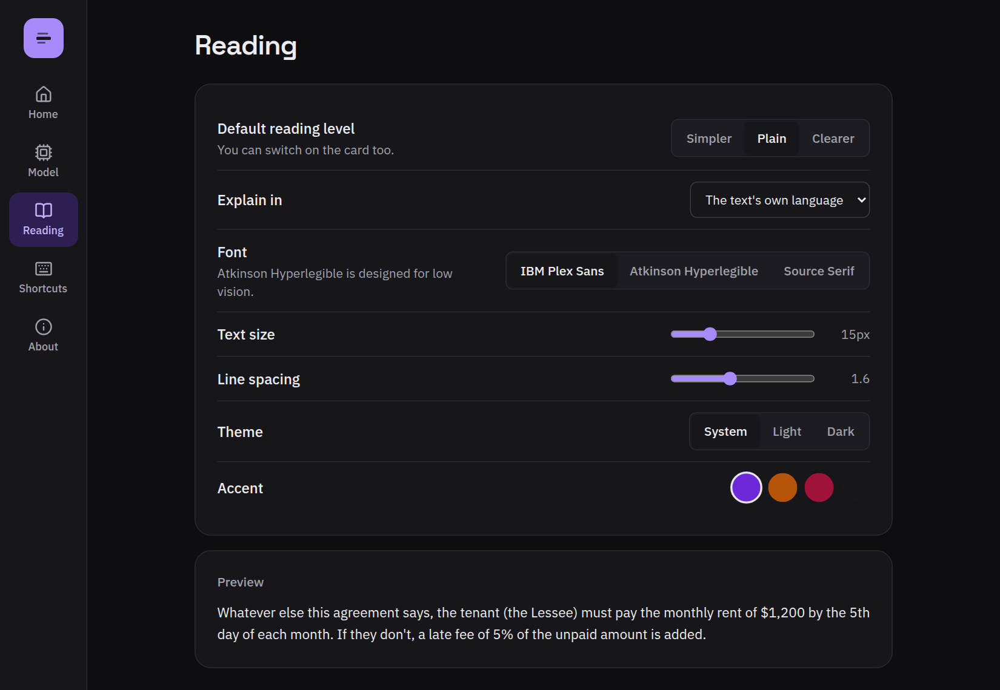
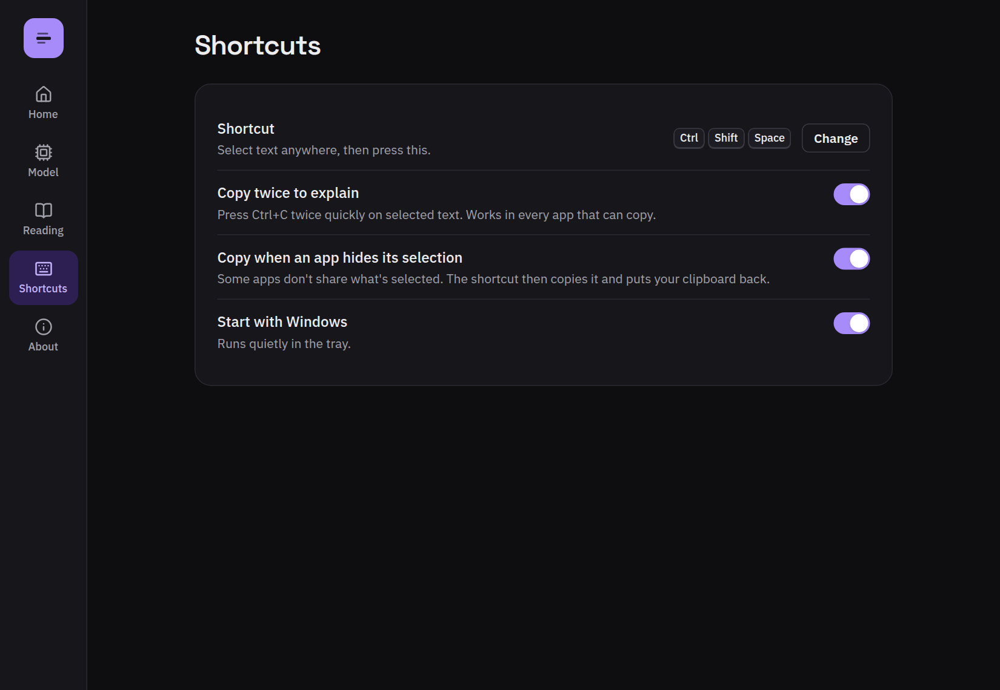
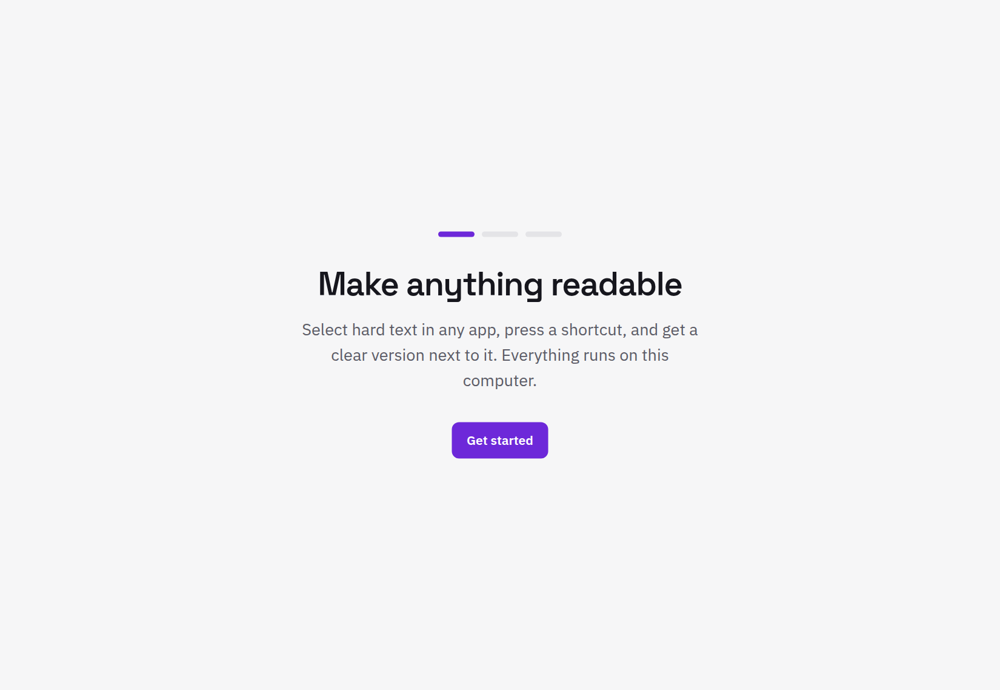
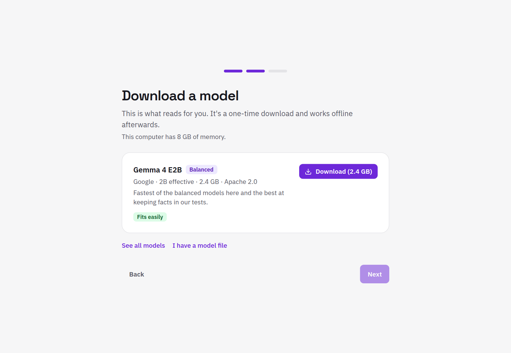

# Text Explainer

[](https://github.com/omikhan4901/text_explainer/actions/workflows/ci.yml)

Select hard text anywhere, press one key, and a clearer version appears right next to it.
Fully offline, on an ordinary 8 GB laptop with no graphics card.

> **Status: ongoing work.** The Windows MVP is built and tested in CI on every push
> (including installing it on a Windows runner and running real models through it); the
> first test on a real Windows desktop and the first release are next. macOS and Linux
> come after. Progress: [`docs/PROGRESS.md`](docs/PROGRESS.md).

**This, from a lease:**

> Notwithstanding any provision of this Agreement to the contrary, the Lessee shall remit
> payment of the monthly rent of $1,200 no later than the 5th day of each calendar month,
> failing which a late fee equivalent to 5% of the outstanding amount shall accrue.

**becomes this, next to your cursor:**

<p>
  
  
</p>

## What it does

- **Readable rewrites, not definitions.** Long sentences, jargon and acronyms become plain
  language at the level you choose (Simpler, Plain, Clearer), keeping every number, date
  and name. A badge shows the reading grade before and after.
- **Never in your way.** The card appears beside what you're reading without taking focus
  from the app you're in. Esc or a click elsewhere closes it.
- **Two ways in.** Select text and press the shortcut (Ctrl+Shift+Space by default), or
  press Ctrl+C twice.
- **It checks itself.** If a rewrite drops or invents a number, date or name, the card
  says so. Answers can't drift into another language: a grammar constrains the model
  token by token.
- **Single words get a dictionary.** A WordNet entry appears instantly, with the meaning
  in context underneath.
- **Runs on your machine.** A small open model through llama.cpp. Nothing you read leaves
  your computer.
- **Your model, your rules.** Pick a model that fits your memory, bring any GGUF file or a
  local Ollama / LM Studio server, and tune every setting, including the instructions.

<p>
  
  
</p>

## The app

A calm settings window: the shortcut, the model, how the card reads. White by default,
dark when the system is.

<p>
  
  
</p>
<p>
  
  
</p>

First run is three steps: one screen to say what it does, one to download a model that
fits, one to try it.

<p>
  
  
</p>

<sub>Screenshots are the real interface rendered against the app's built-in mock; shots of
the installed app come with the first release.</sub>

## Measured, not guessed

The default model was chosen by an evaluation harness that runs 28 passages (legal,
medical, government, finance, news, plus Spanish, Bangla, Hindi and French) through each
model exactly as the app does. On a 4-core CI runner with no GPU
([full results](docs/models.md)):

| | Gemma 4 E2B (default) | Qwen3.5 4B | Qwen3.5 2B |
|---|---|---|---|
| Whole answer (median) | 5.8 s | 7.9 s | 5.4 s |
| First words (median) | 2.2 s | 2.4 s | 1.3 s |
| Peak memory | 3.9 GB | 4.7 GB | 2.1 GB |
| Answers with a fact flagged as missing | 1 of 56 | 2 of 56 | 8 of 56 |
| Answers in the wrong language | 0 | 0 | 0 |

The same evaluation runs on a Windows runner with the engine build the installer ships.
The harness also changed the product: it picked the default model, cut false alarms in
the meaning check, and sized the engine's prompt cache after a memory-saving idea turned
out to make answers 4 to 7 seconds slower.

## How it works

```
selection ─▶ UI Automation (or clipboard-safe copy) ─▶ repair PDF text ─▶ detect language
          ─▶ split long text ─▶ llama-server (grammar blocks other scripts) ─▶ hide chatter
          ─▶ meaning check + reading grade ─▶ the card
```

More in [`docs/marketing/architecture.md`](docs/marketing/architecture.md) and
[`docs/GUIDE.md`](docs/GUIDE.md).

## Built with

Rust · Tauri 2 · React + TypeScript · Tailwind CSS · Radix · llama.cpp · SQLite (WordNet)

111 Rust tests, 10 front-end unit tests and 38 Playwright checks (journeys and WCAG 2.2 AA
scans in light and dark) run on every push, on Linux and on a Windows runner that also
builds, installs and starts the app.

## Development

```bash
npm ci
scripts/check.sh          # every check CI runs on Linux, including a Windows type-check
npm run tauri dev         # run the app (on Windows)
npx vite                  # the interface in a browser, against a mock (popup.html?demo=passage)
```

See [`docs/IMPLEMENTATION_PLAN.md`](docs/IMPLEMENTATION_PLAN.md) for the plan and
[`CLAUDE.md`](CLAUDE.md) for conventions.

## License

MIT. Models have their own licenses, shown in the app before download.
